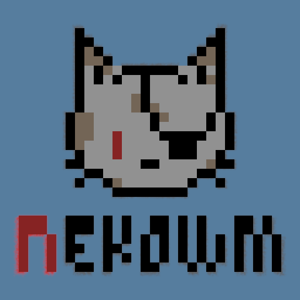
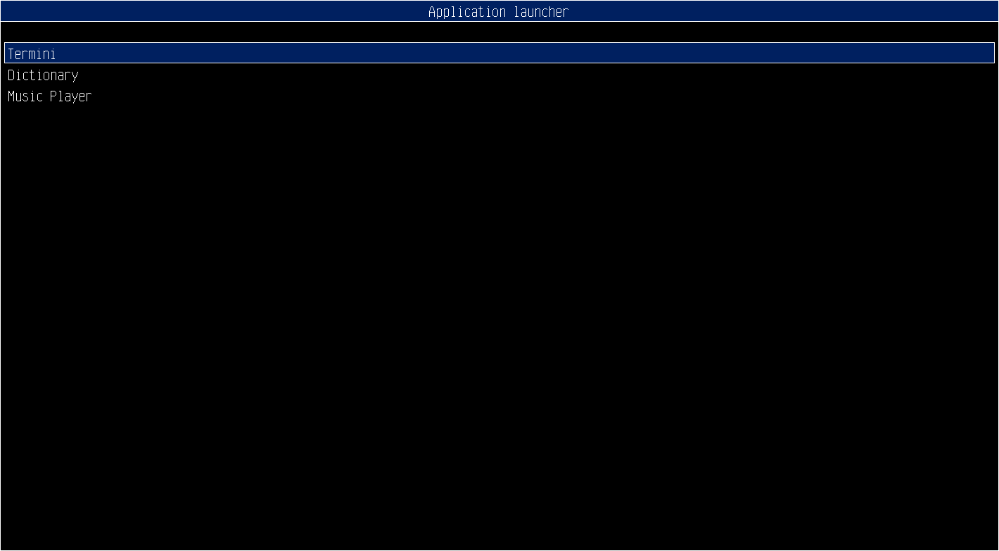

# A window manager for GFXprim proxy backend

A GFXprim proxy backend allows you to display applications into a SHM buffer.

Nekowm is a simple manager that allows you to switch between different
applications connected to the proxy buffer.



## Animation



See autogenerated source code documentation at https://gfxprim.github.io/nekowm/files.html

# How to setup NekoWM


## Setup user and groups

NekoWM runs under regular user account. In order to do that it needs to be able
to access input devices and display.

To enable input devices:
```
sudo usermod -a -G input $USER
```

To enable SPI display:
```
sudo usermod -a -G gpio,spi $USER
```

To enable HDMI/VGA display:
```
sudo usermod -a -G video $USER
```

Where `$USER` is the username the NekoWM will run under.


## Setting up nekowm.conf

After that the configuration file may need to be created. In the case of SPI
display NekoWM needs to know which display it talks to:

The `/etc/nekowm.conf` looks like:
```
{
 "backend_opts": "display:$DISPLAY_MODEL",
 ...
}
```
Where `$DISPLAY_MODEL` is set to gfxprim display model.

Other options:

- "rotate" values "90", "180", "270"

- "font\_family" can be set to gfxprim compiled-in family font name
                 available fonts can be listed with `nekowm -f help`

- "theme" can be set to 'light' or 'dark'

## Booting into nekowm

To boot directly to NekoWM without need to login enable the `nekowm.service` as
a user with:

```
systemctl enable --user nekowm
loginctl enable-linger user
```

Or you can enable the NekoWM login daemon with:
```
sudo systemctl enable nekowm-login.service
```
